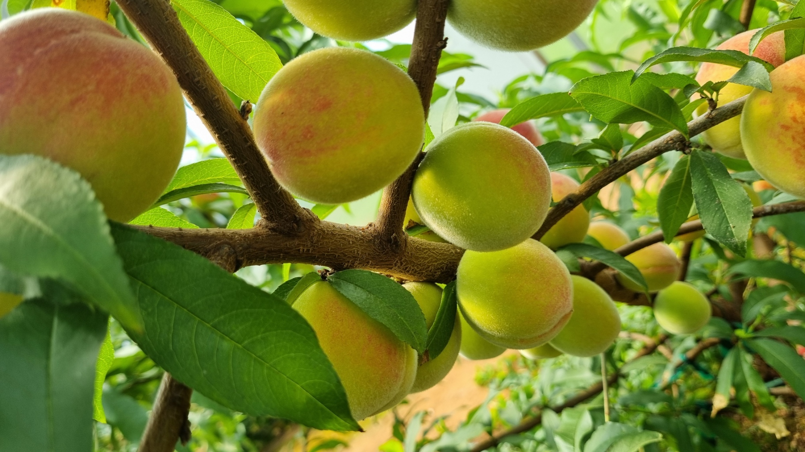

Welcome to my website! I am so glad you are here.

:::{#heading}
I am a Ph.D student in the Department of Horticulture at the University of Georgia, USA. I am part of the Peach and Critrus Breeding program in the [Dr. Dario Chavez Lab](https://site.caes.uga.edu/chavezlab/). Learn more about me [here](about.qmd).  

*Education*

- North Carolina State University | Raleigh, NC  
  - M.S. in Crop Science | Jan 2021 - Dec 2022   
  
- Universidad de San Carlos | Guatemala  
  - B.S. Agronomy with Emphasis in Fruit Crops | Jan 2008 - May 2014  

:::

